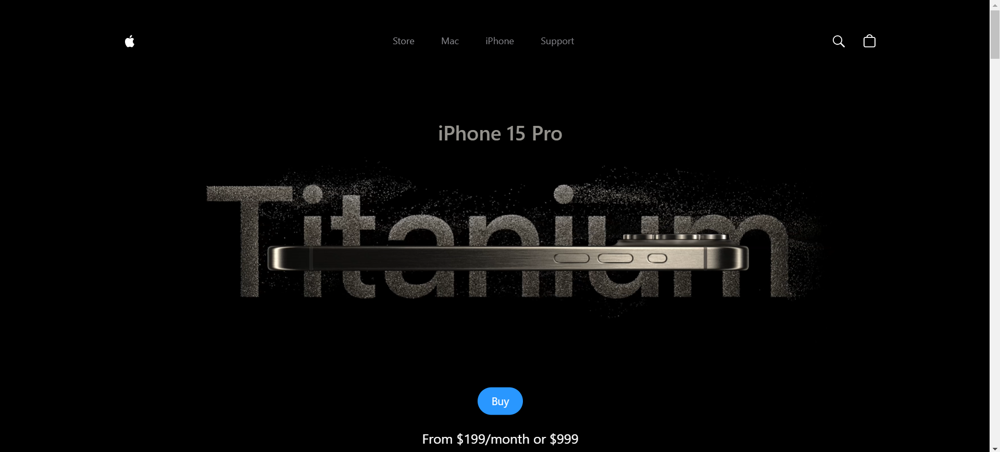

# 3D Iphone Design

## Apple Iphone 3D Design using ReactJS and ThreeJS

This repository contains the __3D Iphone__ source code.


### Requirements
You need to have NodeJS installed in your computer before you can run this project locally, if you do not have NodeJS installed, press [here](https://nodejs.org/en/download/package-manager).
```bash
git clone https://github.com/ars1mm/3d-iphone
```
After cloning the project, please run
```bash
npm install
```
This will install neccesary dependencies to be able to run the project.

Running the project is very easy, insert the following command into the terminal
```bash
npm run dev
```
After running the project your terminal should look something like this
```bash
Vite 5.x.x   ready in 964ms
    -> Local: http://localhost/port
    -> Network: use --host to expose
    -> press h + enter to show help
```
You can easily access the web page by copying the link and pasting it into your browser
### Dependencies
This project uses the following dependencies:

```
  "dependencies": {
    "@gsap/react": "^2.1.1",
    "@react-three/drei": "^9.114.0",
    "@react-three/fiber": "^8.17.8",
    "3d_iphone": "file:",
    "gsap": "^3.12.5",
    "react": "^18.3.1",
    "react-dom": "^18.3.1",
    "three": "^0.169.0"
  },
```